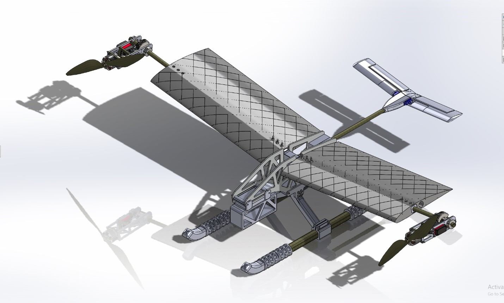

# MCC_VTOL_PROTOTYPE

## Introductions

Hello, my name is Omar Nadeem and alongside Pioter Cetner and Maxim Karsav, we are currently undergoing the recreation of one of Tom Stanton's VTOL drones. 

## File Structure
Folders are categorized in sub-assemblies then versions of the full assembly are used with the naming convention of vXXX with the X being replaced with a 0 or the next letter in the alphabet. 
The code for the following aircraft uses an Arduino based Flight Stabilization Package called dRehmflight created by Nicholas Rehm. This is under the dRehmFlight-Master folder. This is well documented and the modifications and our finished journals will be published here at the end of the project.

